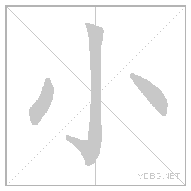
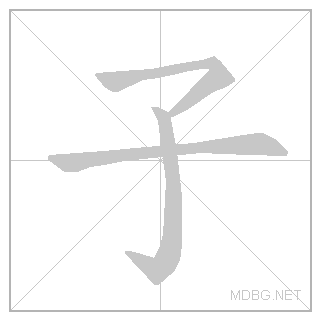

# MIPT Chinese

# My GitHub README

Welcome to my README!

    

This project is for MIPT students who are trying to learn Chinese.
I entered in 2023, so the lessons might be outdated for you.

# Почему бы просто не учить по pdf?

In lessons folder you can find all the lessons we had.

## Новые слова

В китайском языке очень часто у одново иероглифа есть много произношений, и у
одного произношения есть много иероглифов.
У каждого иероглифа может быть много значений, а может и не быть вовсе.

В pdf уроках часто написано только одно значение и прочтение, чего достаточно
для прочтения и перевода диалога, но может быть недостаточно для запоминания.

### Радикалы

Некоторые иероглифы играют важную роль в формировании значения и произношения
более сложных иероглифов, их называют радикалы (также ключи или графемы).

Понимание того, является ли иероглиф радикалом или какие радикалы в нем
содержатся, может очень помочь запомнить этот иероглиф.

Но в pdf уроке об этом ничего не говориться. Это бы занимало очень много места
и значительно бы усложняла и так сложную навигацию по уроку.

### Написание

Очень важно понимать, как пишеться каждый иероглиф.
Кажая черта пишеться по-своему. Слева направо, сверху вниз, с крючком на конце или острием.
Сначала я не верил, что это как-то важно или полезно, но это очень помогает запомнить иероглиф.
Слишком уж много много иероглифов отличаются на одну черту и имеют совершенно разное значение.
И я заметил, что заучивание начертаний действительно помогает сформировать иероглиф у себя в голове, представить его.

Также, на телефоне можно вбивать иероглифы не только по произношению, но и по написанию.
Это помогает запомнить иероглиф. И, если вы не умеете писать правильно, то вы не получите нужный вам иероглиф, что служит как метод проверки себя.

### Хотелось бы

Хотелось бы, чтобы, кликнув на слово, можно было посмотреть всю информацию о нем, как например:

- Иероглиф (hanzi)
- Произношение (pinyin)
- Перевод (meaning)
- Его тип (graphical, radical, word, sentence)
- Услышать, как его произносит носитель языка, или хотя бы робот (sound)
- Написание (strokes)
- Компоненты (components)

### Пример:

(к сожалению, не удается добавить css для github)

  

    你好
  

  
nǐ hǎo

  Type:
    WORD
  
  <audio controls="" src="assets/你好-sound.mp3"></audio
  >
  

    
Strokes:

    

      
      
    

  

  

    
Meaning:

    

      

        
nǐ hǎo

        <ul>
          <li>hello</li>
          <li>hi</li>
        </ul>
      

    

  

  

    
Notes:

  

  

    
Components:

    

      

        

          你
        

        
nǐ

        Type:
          WORD
        
        <audio controls="" src="assets/你-sound.mp3"></audio
        >
        

          
Strokes:

          

            
          

        

        

          
Meaning:

          

            

              
nǐ

              <ul>
                <li>you (informal, as opposed to courteous 您[nin2])</li>
              </ul>
            

          

        

        

          
Notes:

        

        

          
Components:

          

            

              

                亻
              

              
rén

              Type:
                RADICAL
              
              <audio controls="" src="assets/亻-sound.mp3"></audio
              >
              

                
Strokes:

                

                  
                

              

              

                
Meaning:

                

                  

                    
1

                    <ul>
                      <li>human</li>
                    </ul>
                  

                

              

              

                
Notes:

              

              

                
Components:

                

                  

                    

                      ㇒
                    

                    
㇒

                    Type:
                      GRAPHICAL
                    
                    <audio controls="" src="assets/㇒-sound.mp3"></audio
                    >
                    

                      
Strokes:

                      

                        
                      

                    

                    

                      
Meaning:

                      

                    

                    

                      
Notes:

                    

                    

                      
Components:

                      

                    

                  

                  

                    

                      丨
                    

                    
gǔn

                    Type:
                      RADICAL
                    
                    <audio controls="" src="assets/丨-sound.mp3"></audio
                    >
                    

                      
Strokes:

                      

                        
                      

                    

                    

                      
Meaning:

                      

                        

                          
1

                          <ul>
                            <li>line</li>
                          </ul>
                        

                      

                    

                    

                      
Notes:

                    

                    

                      
Components:

                      

                    

                  

                

              

            

            

              

                尔
              

              
ěr

              Type:
                WORD
              
              <audio controls="" src="assets/尔-sound.mp3"></audio
              >
              

                
Strokes:

                

                  
                

              

              

                
Meaning:

                

                  

                    
ěr

                    <ul>
                      <li>variant of 爾|尔[er3]</li>
                    </ul>
                  

                  

                    
ěr

                    <ul>
                      <li>thus</li>
                      <li>so</li>
                      <li>like that</li>
                      <li>you</li>
                      <li>thou</li>
                    </ul>
                  

                

              

              

                
Notes:

              

              

                
Components:

                

                  

                    

                      小
                    

                    
xiǎo

                    Type:
                      RADICAL
                    
                    <audio controls="" src="assets/小-sound.mp3"></audio
                    >
                    

                      
Strokes:

                      

                        
                      

                    

                    

                      
Meaning:

                      

                        

                          
1

                          <ul>
                            <li>small</li>
                          </ul>
                        

                      

                    

                    

                      
Notes:

                    

                    

                      
Components:

                      

                        

                          

                            亅
                          

                          
jué

                          Type:
                            RADICAL
                          
                          <audio
                              controls=""
                              src="assets/亅-sound.mp3"
                            ></audio
                          >
                          

                            
Strokes:

                            

                              
                            

                          

                          

                            
Meaning:

                            

                              

                                
1

                                <ul>
                                  <li>hook</li>
                                </ul>
                              

                            

                          

                          

                            
Notes:

                          

                          

                            
Components:

                            

                          

                        

                        

                          

                            八
                          

                          
[ bā | bá ]

                          Type:
                            RADICAL
                          
                          <audio
                              controls=""
                              src="assets/八-sound.mp3"
                            ></audio
                          >
                          

                            
Strokes:

                            

                              
                            

                          

                          

                            
Meaning:

                            

                              

                                
1

                                <ul>
                                  <li>eight</li>
                                  <li>divide</li>
                                </ul>
                              

                            

                          

                          

                            
Notes:

                          

                          

                            
Components:

                            

                              

                                

                                  ㇒
                                

                                
㇒

                                Type:
                                  GRAPHICAL
                                
                                <audio
                                    controls=""
                                    src="assets/㇒-sound.mp3"
                                  ></audio
                                >
                                

                                  
Strokes:

                                  

                                    
                                  

                                

                                

                                  
Meaning:

                                  

                                

                                

                                  
Notes:

                                

                                

                                  
Components:

                                  

                                

                              

                            

                          

                        

                      

                    

                  

                  

                    

                      ⺈
                    

                    
⺈

                    Type:
                      RADICAL
                    
                    <audio controls="" src="assets/⺈-sound.mp3"></audio
                    >
                    

                      
Strokes:

                      

                        
                      

                    

                    

                      
Meaning:

                      

                        

                          
1

                          <ul>
                            <li>knife</li>
                          </ul>
                        

                      

                    

                    

                      
Notes:

                    

                    

                      
Components:

                      

                        

                          

                            勹
                          

                          
bāo

                          Type:
                            RADICAL
                          
                          <audio
                              controls=""
                              src="assets/勹-sound.mp3"
                            ></audio
                          >
                          

                            
Strokes:

                            

                              
                            

                          

                          

                            
Meaning:

                            

                              

                                
1

                                <ul>
                                  <li>wrap</li>
                                </ul>
                              

                            

                          

                          

                            
Notes:

                          

                          

                            
Components:

                            

                              

                                

                                  ㇒
                                

                                
㇒

                                Type:
                                  GRAPHICAL
                                
                                <audio
                                    controls=""
                                    src="assets/㇒-sound.mp3"
                                  ></audio
                                >
                                

                                  
Strokes:

                                  

                                    
                                  

                                

                                

                                  
Meaning:

                                  

                                

                                

                                  
Notes:

                                

                                

                                  
Components:

                                  

                                

                              

                              

                                

                                  ㇆
                                

                                
㇆

                                Type:
                                  GRAPHICAL
                                
                                <audio
                                    controls=""
                                    src="assets/㇆-sound.mp3"
                                  ></audio
                                >
                                

                                  
Strokes:

                                  

                                    
                                  

                                

                                

                                  
Meaning:

                                  

                                

                                

                                  
Notes:

                                

                                

                                  
Components:

                                  

                                

                              

                            

                          

                        

                      

                    

                  

                

              

            

          

        

      

      

        

          好
        

        
[ hǎo | hào ]

        Type:
          WORD
        
        <audio controls="" src="assets/好-sound.mp3"></audio
        >
        

          
Strokes:

          

            
          

        

        

          
Meaning:

          

            

              
hǎo

              <ul>
                <li>good</li>
                <li>well</li>
                <li>proper</li>
                <li>good to</li>
                <li>easy to</li>
                <li>very</li>
                <li>so</li>
                <li>(suffix indicating completion or readiness)</li>
                <li>(of two people) close</li>
                <li>on intimate terms</li>
                <li>(after a personal pronoun) hello</li>
              </ul>
            

            

              
hào

              <ul>
                <li>to be fond of</li>
                <li>to have a tendency to</li>
                <li>to be prone to</li>
              </ul>
            

          

        

        

          
Notes:

        

        

          
Components:

          

            

              

                女
              

              
[ nǚ | nǜ | rǔ ]

              Type:
                RADICAL
              
              <audio controls="" src="assets/女-sound.mp3"></audio
              >
              

                
Strokes:

                

                  
                

              

              

                
Meaning:

                

                  

                    
1

                    <ul>
                      <li>woman</li>
                    </ul>
                  

                

              

              

                
Notes:

              

              

                
Components:

                

                  

                    

                      ㇛
                    

                    
㇛

                    Type:
                      GRAPHICAL
                    
                    <audio controls="" src="assets/㇛-sound.mp3"></audio
                    >
                    

                      
Strokes:

                      

                        
                      

                    

                    

                      
Meaning:

                      

                    

                    

                      
Notes:

                    

                    

                      
Components:

                      

                    

                  

                  

                    

                      丆
                    

                    
hǎn

                    Type:
                      WORD
                    
                    <audio controls="" src="assets/丆-sound.mp3"></audio
                    >
                    

                      
Strokes:

                      

                        
                      

                    

                    

                      
Meaning:

                      

                        

                          
xx

                          <ul>
                            <li>
                              one of the characters used in kwukyel (phonetic
                              &quot;myeon&quot;), an ancient Korean writing
                              system
                            </li>
                          </ul>
                        

                      

                    

                    

                      
Notes:

                    

                    

                      
Components:

                      

                        

                          

                            一
                          

                          
[ yī | yí | yì ]

                          Type:
                            RADICAL
                          
                          <audio
                              controls=""
                              src="assets/一-sound.mp3"
                            ></audio
                          >
                          

                            
Strokes:

                            

                              
                            

                          

                          

                            
Meaning:

                            

                              

                                
1

                                <ul>
                                  <li>one</li>
                                </ul>
                              

                            

                          

                          

                            
Notes:

                          

                          

                            
Components:

                            

                          

                        

                        

                          

                            丿
                          

                          
[ piě | yì ]

                          Type:
                            RADICAL
                          
                          <audio
                              controls=""
                              src="assets/丿-sound.mp3"
                            ></audio
                          >
                          

                            
Strokes:

                            

                              
                            

                          

                          

                            
Meaning:

                            

                              

                                
1

                                <ul>
                                  <li>bend</li>
                                </ul>
                              

                            

                          

                          

                            
Notes:

                          

                          

                            
Components:

                            

                          

                        

                      

                    

                  

                

              

            

            

              

                子
              

              
[ zi | zǐ ]

              Type:
                RADICAL
              
              <audio controls="" src="assets/子-sound.mp3"></audio
              >
              

                
Strokes:

                

                  
                

              

              

                
Meaning:

                

                  

                    
1

                    <ul>
                      <li>child</li>
                    </ul>
                  

                

              

              

                
Notes:

              

              

                
Components:

                

                  

                    

                      一
                    

                    
[ yī | yí | yì ]

                    Type:
                      RADICAL
                    
                    <audio controls="" src="assets/一-sound.mp3"></audio
                    >
                    

                      
Strokes:

                      

                        
                      

                    

                    

                      
Meaning:

                      

                        

                          
1

                          <ul>
                            <li>one</li>
                          </ul>
                        

                      

                    

                    

                      
Notes:

                    

                    

                      
Components:

                      

                    

                  

                  

                    

                      了
                    

                    
[ le | liǎo | liào ]

                    Type:
                      WORD
                    
                    <audio controls="" src="assets/了-sound.mp3"></audio
                    >
                    

                      
Strokes:

                      

                        
                      

                    

                    

                      
Meaning:

                      

                        

                          
le

                          <ul>
                            <li>(completed action marker)</li>
                            <li>
                              (modal particle indicating change of state,
                              situation now)
                            </li>
                            <li>
                              (modal particle intensifying preceding clause)
                            </li>
                          </ul>
                        

                        

                          
liǎo

                          <ul>
                            <li>to finish</li>
                            <li>to achieve</li>
                            <li>variant of 瞭|了[liao3]</li>
                            <li>to understand clearly</li>
                          </ul>
                        

                        

                          
liǎo

                          <ul>
                            <li>(of eyes) bright</li>
                            <li>clear-sighted</li>
                            <li>to understand clearly</li>
                          </ul>
                        

                        

                          
liào

                          <ul>
                            <li>unofficial variant of 瞭[liao4]</li>
                          </ul>
                        

                      

                    

                    

                      
Notes:

                    

                    

                      
Components:

                      

                        

                          

                            亅
                          

                          
jué

                          Type:
                            RADICAL
                          
                          <audio
                              controls=""
                              src="assets/亅-sound.mp3"
                            ></audio
                          >
                          

                            
Strokes:

                            

                              
                            

                          

                          

                            
Meaning:

                            

                              

                                
1

                                <ul>
                                  <li>hook</li>
                                </ul>
                              

                            

                          

                          

                            
Notes:

                          

                          

                            
Components:

                            

                          

                        

                        

                          

                            ㇇
                          

                          
㇇

                          Type:
                            GRAPHICAL
                          
                          <audio
                              controls=""
                              src="assets/㇇-sound.mp3"
                            ></audio
                          >
                          

                            
Strokes:

                            

                              
                            

                          

                          

                            
Meaning:

                            

                          

                          

                            
Notes:

                          

                          

                            
Components:

                            

                          

                        

                      

                    

                  

                

              

            

          

        

      

    

  

## Тексты и диалоги

Все уроки содержат как минимум один диалог и один текст.
Мне не нравится читать и учить диалоги в pdf по нескольким причинам.

- Постоянно смотреть произношение и перевод новых слов (или уже знакомых) занимает очень много времени и сил.

- Когда под каждым словом есть пиньинь, очень легко посмотреть произношение и сразу его забыть.

Хотелось бы просто навести курсор на новое слово в тексте и посмотреть его произношение и перевод.

Пример из [диалога 15 урока](lessons/lesson_15/dialogue1.md):

8. <b><u>迪玛</u></b>：除了<abbr title='zhìzuò - вырабатывать; производить'>制作</abbr><abbr title='biāoběn - образец, модель, экспонат / препарат'>标本</abbr>，我还不太会用<abbr title='xiǎnwēijìng - микроскоп'>显微镜</abbr>。我不知道怎么<abbr title='tiáojié - регулировать, настраивать'>调节</abbr><abbr title='shìyě - обзор, поле зрения'>视野</abbr>中的<abbr title='liàngdù - физ. яркость; блеск, освещение'>亮度</abbr>。

# Anki

[Anki](https://apps.ankiweb.net/) is a great tool for memorizing words.

## Get started

- Download the anki_deck.apkg file in the root of this repo, by cloning the repo f.e.
- Install Anki.
- Import anki_deck.apkg to Anki.
  Top left corner → File → Import → Select anki_deck.apkg

## Learn new words

https://github.com/user-attachments/assets/3f6c0a30-70eb-4616-a798-df0706ac4cf5

## Contribute

Not supported yet 😅
